# 统一扫码

## 介绍

本示例展示了使用统一扫码提供的“扫码直达”服务、默认界面扫码能力、自定义界面扫码能力、图像识码能力、码图生成能力。

需要使用统一扫码服务接口 import { scanCore, scanBarcode, customScan, detectBarcode, generateBarcode } from '
@kit.ScanKit';

## 效果预览

|            **应用首页**             |               **扫码直达**               |
|:-------------------------------:|:------------------------------------:|
| 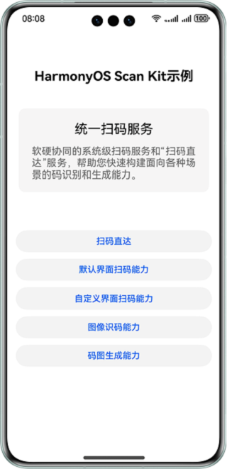 | 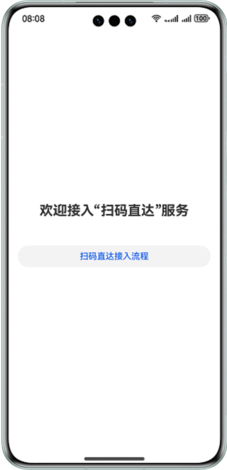 |

|            **应用首页**             | **默认界面扫码**                             |                  **扫码结果单码**                  |                 **扫码结果多码**                 |               **默认界面扫码结果**               |
|:-------------------------------:|----------------------------------------|:--------------------------------------------:|:------------------------------------------:|:----------------------------------------:|
|  | 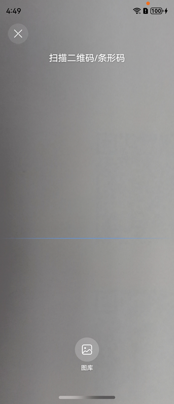 | 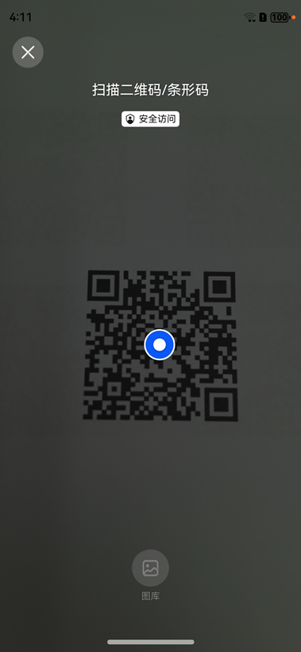 | 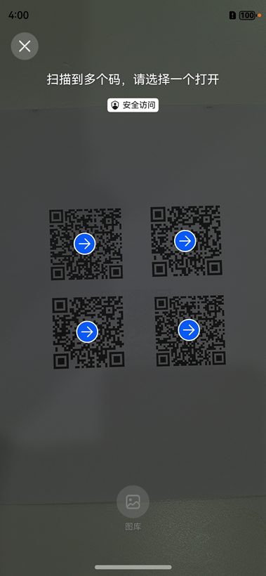 |  |

|            **应用首页**             |              **自定义界面扫码**              |                 **扫码结果单码**                  |                 **扫码结果多码**                 |                     **自定义界面扫码结果**                      |
|:-------------------------------:|:-------------------------------------:|:-------------------------------------------:|:------------------------------------------:|:------------------------------------------------------:|
|  | 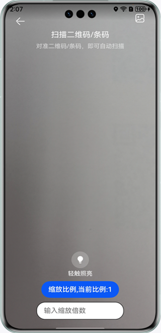 | 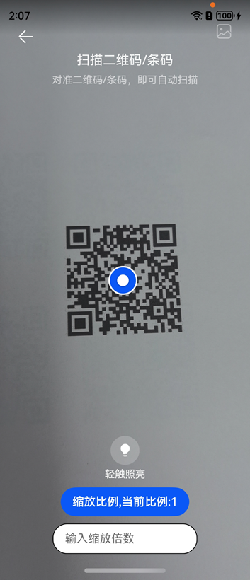 | 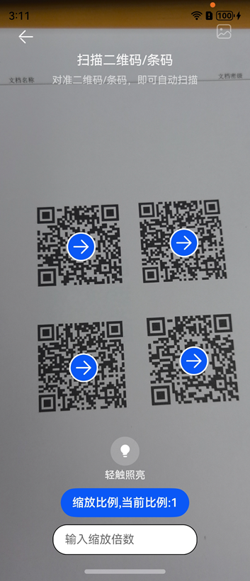 | 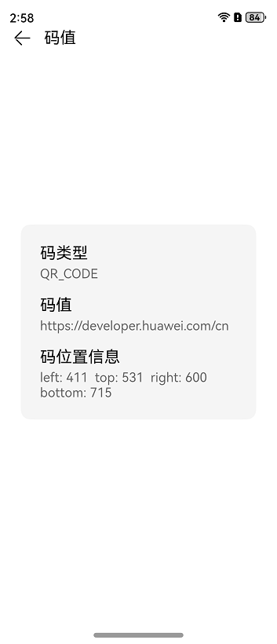 |

|            **应用首页**             |             **自定义界面扫码-YUV**              |
|:-------------------------------:|:----------------------------------------:|
|  | 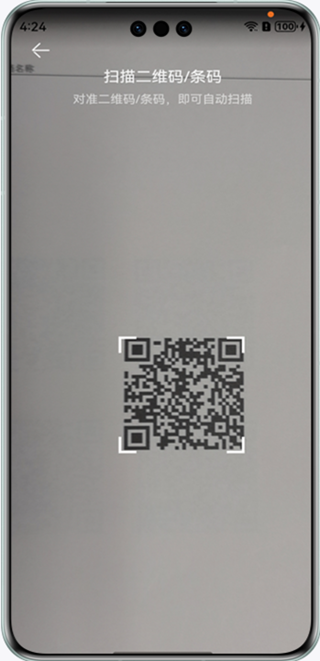 |

|            **应用首页**             | **自定义界面扫码能力-推荐样例**                       |                 **扫码结果单码**                  |                **扫码结果多码**                 |               **推荐样例扫码结果**               |
|:-------------------------------:|------------------------------------------|:-------------------------------------------:|:-----------------------------------------:|:----------------------------------------:|
|  | 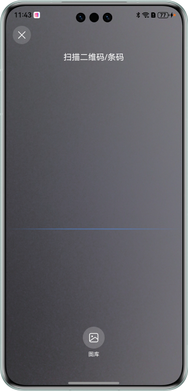 | 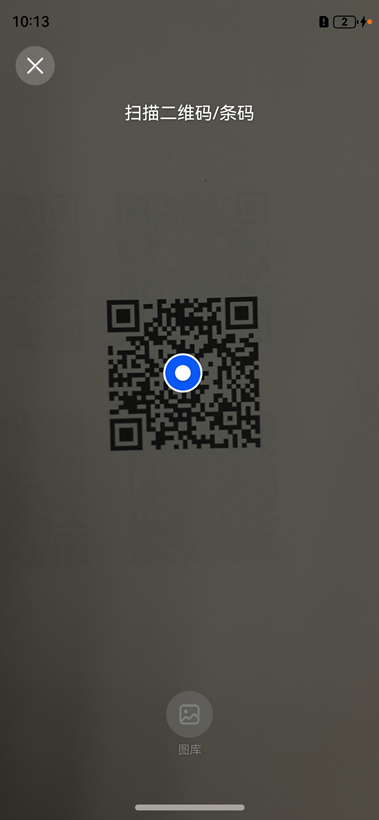 | 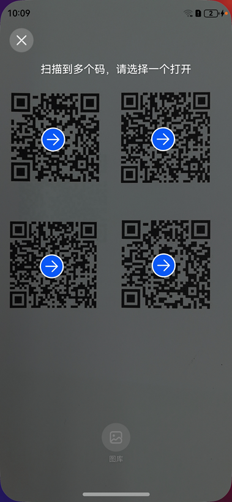 |  |

|            **应用首页**             |                 **识别本地图片**                 |                 **识别本地图片结果单码**                 |                **识别本地图片结果多码**                 |                      **识别本地图片结果**                      |               **识别图像数据**               |
|:-------------------------------:|:----------------------------------------------:|:----------------------------------------------:|:---------------------------------------------:|:------------------------------------------------------:|:--------------------------------------:|
|  | 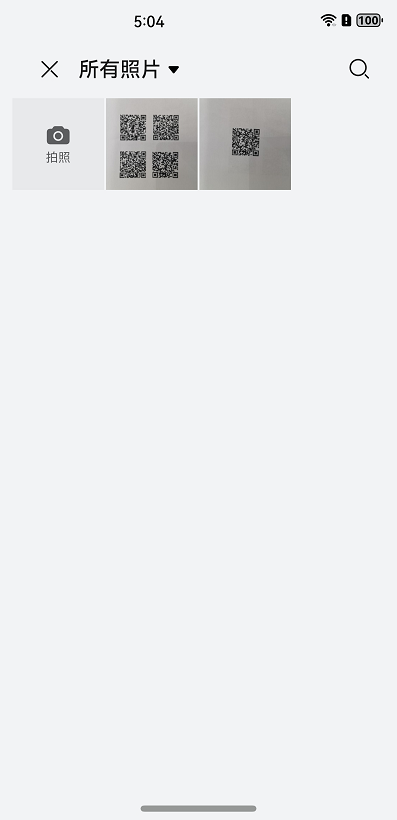 |  |  |  |  |

|            **应用首页**             |             **码图生成界面**              |                **码图生成结果**                 |
|:-------------------------------:|:-----------------------------------:|:-----------------------------------------:|
|  | 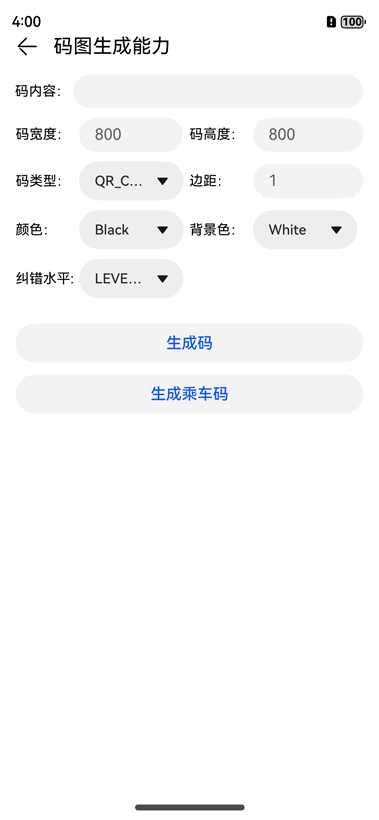 | 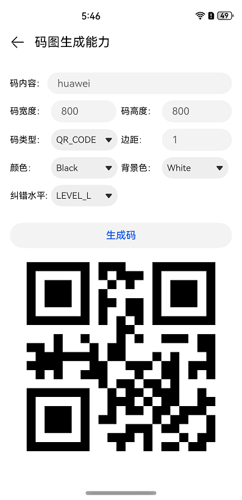 |

使用说明：
1. 在手机的主屏幕，点击“统一扫码示例”，启动应用，在主界面可见“扫码直达”、“默认界面扫码能力”、“自定义界面扫码能力”、“图像识码能力”、“码图生成能力”按钮。
2. 点击“扫码直达”按钮，进入二级界面，点击“扫码直达接入流程”介绍了开发流程和步骤说明。
3. 点击“默认界面扫码能力”按钮，进入二级界面，点击“默认界面扫码能力”按钮，拉起默认扫码页面，扫描码图，返回结果。
4. 点击“自定义界面扫码能力”按钮，进入二级界面，再次点击“自定义界面扫码能力”按钮，通过promise调用方式拉起自定义扫码界面，扫描码图，返回结果。
5. 点击“自定义界面扫码能力”按钮，进入二级界面，点击“自定义界面扫码能力-YUV”按钮，通过callback调用方式拉起自定义扫码界面，扫描码图，实时显示码图位置。
6. 点击“自定义界面扫码能力”按钮，进入二级界面，点击“自定义界面扫码能力-推荐样例”按钮，通过推荐方式构建自定义扫码界面，扫描码图，返回结果。
7. 点击“图像识码能力”按钮，进入二级界面，点击“识别本地图片”按钮，拉起picker从图库中选择图片，进行图像识码，返回结果。
8. 点击“图像识码能力”按钮，进入二级界面，点击“识别图像数据”按钮，返回示例结果。
9. 点击“码图生成能力”按钮，进入二级界面，调用码图生成接口，生成不同类型的码图。

## 工程目录

├─entry/src/main/ets // 代码区  
│ ├─common  
│ │ ├─CommonComponents.ets // 公共组件  
│ │ ├─CommonTipsDialog.ts // 公共提示弹窗  
│ │ ├─GlobalThisUtil.ts // globalThis封装类  
│ │ ├─logger.ts // 日志打印方法  
│ │ ├─StatusBar.ets // 状态栏组件  
│ │ ├─Utils.ts // 公共方法  
│ ├─entryability                
│ │ └─EntryAbility.ets // 程序入口类  
│ ├─pages      
│ │ ├─access // 扫码直达  
│ │ │ ├─ScanAccess.ets // 扫码直达页连接成功页面  
│ │ │ ├─ScanDetail.ets // 扫码直达详情页面  
│ │ ├─customScan //自定义扫码  
│ │ │ ├─CommonCodeLayout.ets //蓝点组件  
│ │ │ ├─CustomPage.ets // 自定义扫码按钮入口页面  
│ │ │ ├─CustomScan.ets // 自定义扫码页面  
│ │ │ ├─CustomYuv.ets // 自定义扫码YUV页面  
│ │ │ ├─PermissionsUtil.ets // 相机授权类  
│ │ ├─customScanDefault // 自定义界面扫码能力-推荐样例  
│ │ │ ├─constants // 常量  
│ │ │ │ ├─BreakpointConstants.ets // 断点常量  
│ │ │ │ ├─CommonConstants.ts // 公共常量  
│ │ │ ├─model        
│ │ │ │ ├─BreakpointType.ets // 断点  
│ │ │ │ ├─CommonEventManager.ets // 公共事件管理  
│ │ │ │ ├─openPhoto.ets // 图库  
│ │ │ │ ├─PromptTone.ts // 提示音  
│ │ │ │ ├─ScanService.ets // 自定义扫码  
│ │ │ │ ├─ScanSize.ets // 扫面界面尺寸  
│ │ │ ├─pages // 页面  
│ │ │ │ ├─ScanPage.ets // 扫码页面  
│ │ │ ├─view // 组件  
│ │ │ │ ├─CommonCodeLayout.ets // 蓝点组件  
│ │ │ │ ├─IconPress.ets // 图片按压效果组件  
│ │ │ │ ├─MaskLayer.ets // 遮罩  
│ │ │ │ ├─pickerDialog.ets // 模态框组件  
│ │ │ │ ├─ScanBottom.ets // 底部组件  
│ │ │ │ ├─ScanLine.ets // 扫描线组件  
│ │ │ │ ├─ScanLoading.ets // 加载组件  
│ │ │ │ ├─ScanTitle.ets // 标题组件  
│ │ │ │ ├─ScanTopTool.ets // 顶部组件  
│ │ │ │ ├─ScanXComponent.ets // XComponent组件  
│ │ ├─defaultScan //默认界面扫码  
│ │ │ ├─DefaultScan.ets //默认界面扫码  
│ │ ├─detectBarcode // 图像识码  
│ │ │ ├─CommonCodeLayout.ets // 蓝点组件   
│ │ │ ├─DecodeBarcode.ets // 图像识码按钮入口页面  
│ │ │ ├─DecodeCameraYuv.ets // 识别图像数据页面                
│ │ ├─generateBarcode // 码图生成  
│ │ │ ├─CreateBarcode.ets // 码图生成页面  
│ │ ├─resultPage // 扫码结果  
│ │ │ ├─ResultPage.ets // 扫码结果页面   
│ │ └─Index.ets // 统一扫码入口页面  
└─entry/src/main/resources // 资源文件目录

## 具体实现

默认界面扫码：提供系统级体验一致的扫码界面，包含相机预览流，相册扫码入口，暗光环境闪光灯开启提示，具备相机预授权，集成简单，适用于通用扫码场景。
在import { scanCore, scanBarcode } from '@kit.ScanKit';定义了默认扫码服务接口API：

* startScanForResult(context: common.Context, options?: ScanOptions): Promise&lt;ScanResult&gt;
* startScanForResult(context: common.Context, options: ScanOptions, callback: AsyncCallback&lt;ScanResult&gt;): void
* startScanForResult(context: common.Context, callback: AsyncCallback&lt;ScanResult&gt;): void

自定义界面扫码：提供扫码能力并支持在指定控件上渲染相机预览流，需要开发者实现扫码界面，申请相机权限，适用于对扫码界面有个性化定制的场景。
在import { customScan } from '@kit.ScanKit';定义了自定义扫码API：

* init(options?: scanBarcode.ScanOptions): void
* start(viewControl: ViewControl): Promise&lt;Array&lt;scanBarcode.ScanResult&gt;&gt;
* stop(): Promise&lt;void&gt;
* release(): Promise&lt;void&gt;
* start(viewControl: ViewControl, callback: AsyncCallback&lt;Array&lt;scanBarcode.ScanResult&gt;&gt;, frameCallback?:
  AsyncCallback&lt;ScanFrame&gt;): void
* getFlashLightStatus(): boolean
* openFlashLight(): void
* closeFlashLight(): void
* setZoom(zoomValue : number): void
* getZoom(): number
* setFocusPoint(point: scanBarcode.Point): void
* resetFocus(): void
* rescan(): void
* stop(callback: AsyncCallback&lt;void&gt;): void
* release(callback: AsyncCallback&lt;void&gt;): void
* on(type: 'lightingFlash', callback: AsyncCallback&lt;boolean&gt;): void
* off(type: 'lightingFlash', callback?: AsyncCallback&lt;boolean&gt;): void

图像识码：对图库中的码图或图像数据进行扫描识别。
在import { detectBarcode } from '@kit.ScanKit';定义了图像识码API：

* decode(inputImage: InputImage, options?: scanBarcode.ScanOptions): Promise&lt;Array&lt;scanBarcode.ScanResult&gt;&gt;
* decode(inputImage: InputImage, options: scanBarcode.ScanOptions, callback: AsyncCallback&lt;Array&lt;
  scanBarcode.ScanResult&gt;&gt;): void
* decode(inputImage: InputImage, callback: AsyncCallback&lt;Array&lt;scanBarcode.ScanResult&gt;&gt;): void
* decodeImage(image: ByteImage, options?: scanBarcode.ScanOptions): Promise&lt;DetectResult&gt;

码图生成：将字符串或字节数组转换为自定义格式的码图。
在import { generateBarcode } from '@kit.ScanKit';定义了码图生成API：

* createBarcode(content: string, options: CreateOptions): Promise&lt;image.PixelMap&gt;
* createBarcode(content: string, options: CreateOptions, callback: AsyncCallback&lt;image.PixelMap&gt;): void
* createBarcode(content: ArrayBuffer, options: CreateOptions): Promise&lt;image.PixelMap&gt;

## 相关权限

自定义扫码功能获取相机权限: ohos.permission.CAMERA。   
自定义扫码功能获取震动权限: ohos.permission.VIBRATE。

## 依赖

依赖设备具备相机能力。

## 约束与限制

1. 本实例仅支持标准系统上运行，支持设备：华为手机、华为平板。
2. HarmonyOS系统：HarmonyOS NEXT Developer Beta2及以上。
3. DevEco Studio版本：DevEco Studio NEXT Developer Beta2及以上。
4. HarmonyOS SDK版本：HarmonyOS NEXT Developer Beta2 SDK及以上。