# Scan Kit

## Introduction

This sample code illustrates how to use the capabilities provided by Scan Kit, including barcode scan by the default UI, barcode scan by the custom UI, image-based barcode recognition, and barcode image generation.

The **import { scanCore, scanBarcode, customScan, detectBarcode, generateBarcode } from '@kit.ScanKit';** API of Scan Kit needs to be used.

## Effect Preview

|          **App Home Screen**          | **Barcode Scan by Default UI**           |        **Scan Result (Single Barcode)**        |     **Scan Result (Multiple Barcodes)**      |    **Barcode Scan Result (Default UI)**    |
| :-----------------------------------: | ---------------------------------------- | :--------------------------------------------: | :------------------------------------------: | :----------------------------------------: |
| 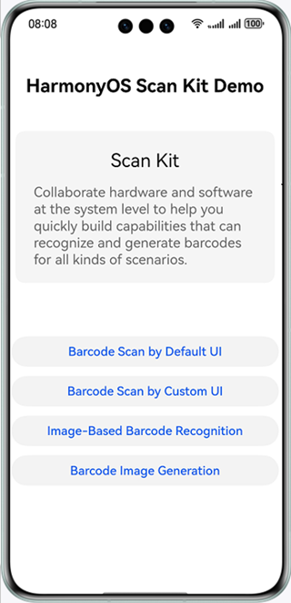 | 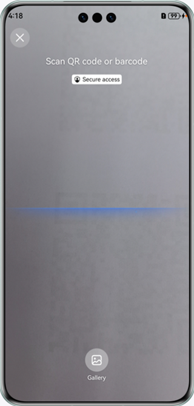 | 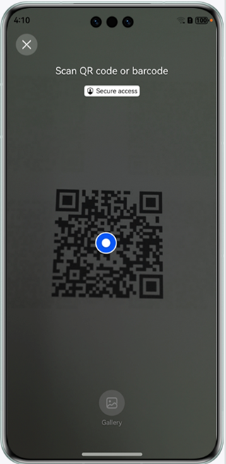 | 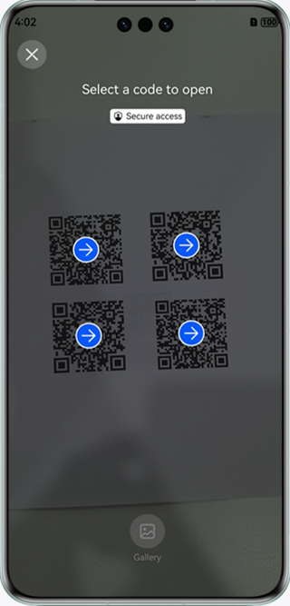 | 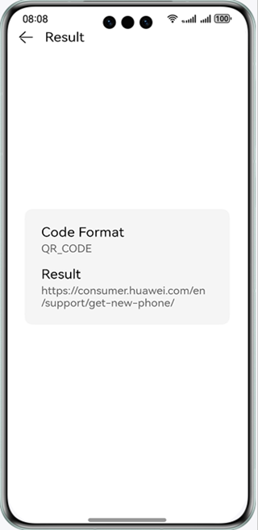 |

|          **App Home Screen**          |      **Barcode Scan by Custom UI**      |       **Scan Result (Single Barcode)**        |     **Scan Result (Multiple Barcodes)**      |           **Barcode Scan Result (Custom UI)**            |
| :-----------------------------------: | :-------------------------------------: | :-------------------------------------------: | :------------------------------------------: | :------------------------------------------------------: |
|  | 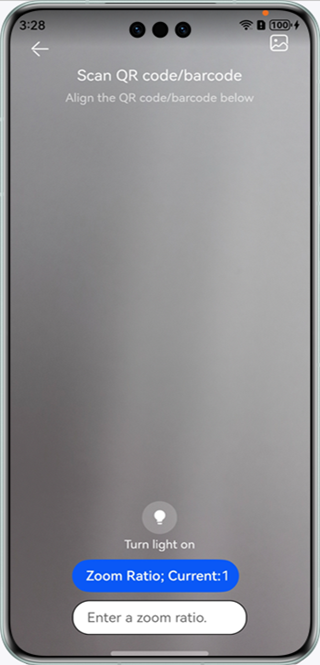 | 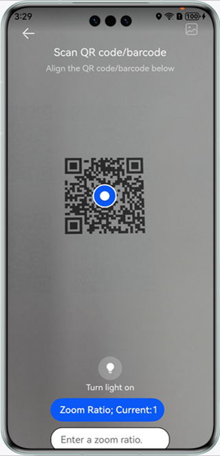 | 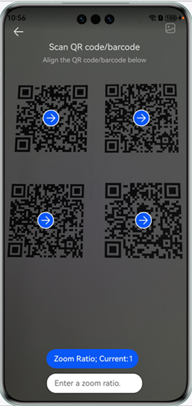 | 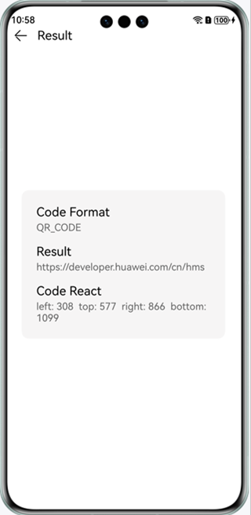 |

|          **App Home Screen**          |    **Barcode Scan by Custom UI (YUV)**     |
| :-----------------------------------: | :----------------------------------------: |
|  | 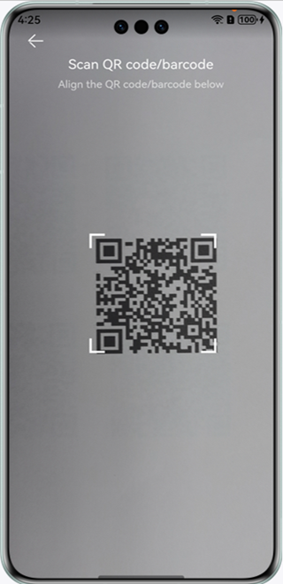 |

<table>
  <tr>
    <th width=20%>App Home Screen</th>
    <th width=20%>Barcode Scan by Custom UI – Recommended Example</th>
    <th width=20%>Scan Result (Single Barcode)</th>
    <th width=20%>Scan Result (Multiple Barcodes)</th>
    <th width=20%>Barcode Scan Result (Recommended Example)</th>
  </tr>
  <tr>
    <td></td>
    <td>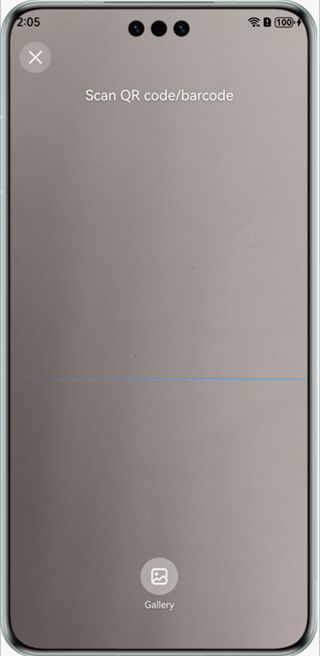</td>
    <td>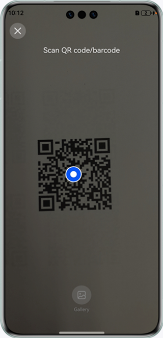</td>
    <td>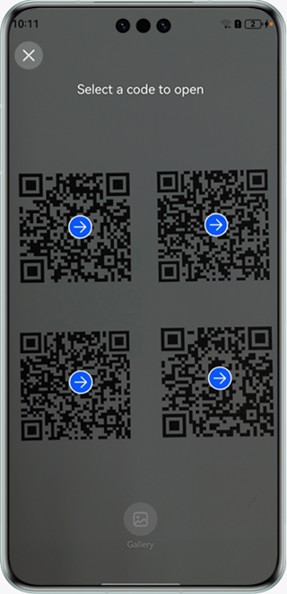</td>
    <td></td>
  </tr>
</table>

<table>
  <tr>
    <th width=20%>App Home Screen</th>
    <th width=20%>Recognize Local Images</th>
    <th width=20%>Image-Based Barcode Recognition Result (Single Barcode)</th>
    <th width=20%>Image-Based Barcode Recognition Result (Multiple Barcodes)</th>
    <th width=20%>Image-Based Barcode Recognition Result</th>
  </tr>
  <tr>
    <td></td>
    <td>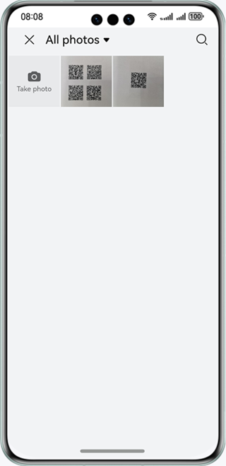</td>
    <td>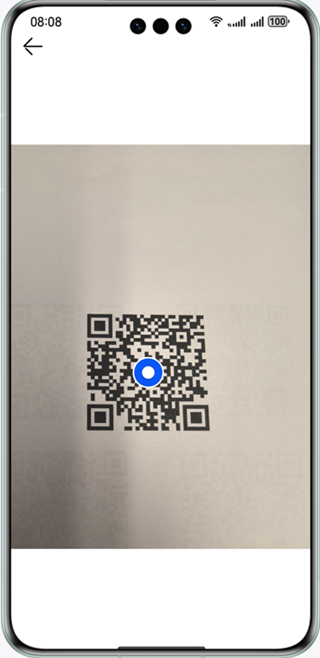</td>
    <td>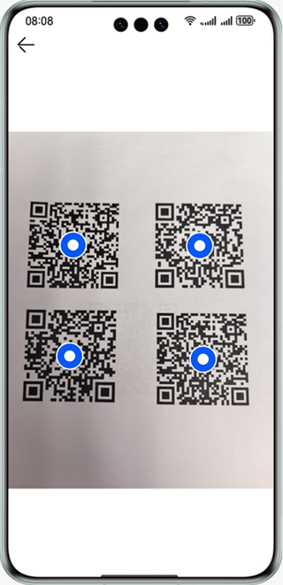</td>
    <td></td>
  </tr>
</table>

|          **App Home Screen**          |        **Recognize Image Data**        |
| :-----------------------------------: | :------------------------------------: |
|  | 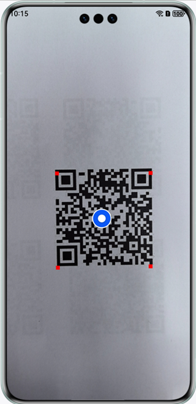 |

|          **App Home Screen**          |    **Barcode Image Generation UI**    |     **Barcode Image Generation Result**     |
| :-----------------------------------: | :-----------------------------------: | :-----------------------------------------: |
|  | 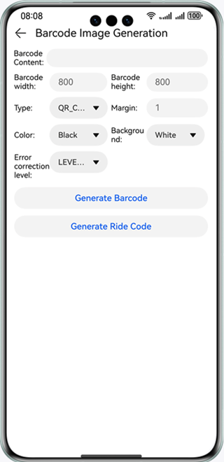 | 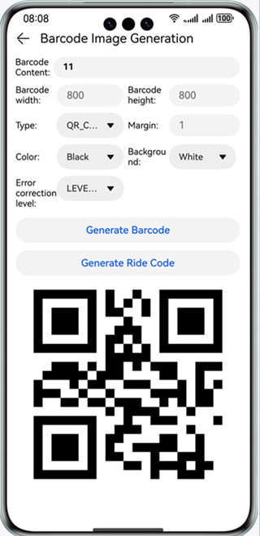 |
|                Usage:                 |                                       |                                             |

1. Tap **Scan Kit Demo** on the home screen of your device to start the demo app. The following buttons will be displayed on the demo app home screen: **Barcode Scan by Default UI**, **Barcode Scan by Custom UI**, **Image-Based Barcode Recognition**, and **Barcode Image Generation**.
2. Tap **Barcode Scan by Default UI** to launch the default barcode scan UI, scan a barcode image, and check the scan result.
3. Tap **Barcode Scan by Custom UI** to go to the level-2 UI. Tap **Barcode Scan by Custom UI** again to launch the custom barcode scan UI, scan a barcode image, and check the scan result through a promise.
4. Tap **Barcode Scan by Custom UI** to go to the level-2 UI. Tap **Barcode Scan by Custom UI (YUV)** to launch the custom barcode scan UI, scan a barcode image, and check the scan result through a callback.
5. Tap **Barcode Scan by Custom UI** to go to the level-2 UI. Tap **Barcode Scan by Custom UI – Recommended Example** to customize a barcode scan UI using the recommended method, scan a barcode image, and obtain the scan result.
6. Tap **Image-Based Barcode Recognition** to the level-2 page and tap **Recognize Local Images** to start the picker, select a barcode image from the gallery for recognition, and check the scan result.
7. Tap **Image-Based Barcode Recognition** to the level-2 page and tap **Recognize Image Data** to check the scan result.
8. Tap **Barcode Image Generation** to call the barcode image generation API to generate different types of barcode images.

## Project Directory

├─entry/src/main/ets         //  Code area.  
│ ├─common  
│ │ ├─CommonComponents.ets          // Common components.              
│ │ ├─GlobalThisUtil.ts           // Class that encapsulates **globalThis**.              
│ │ ├─StatusBar.ets          // Status bar component.              
│ │ ├─Utils.ts          // Common methods.  
│ ├─entryability                    
│ │ └─EntryAbility.ets          // Entry point class.   
│ ├─pages                            
│ │ ├─customScan          // Barcode scanning customization.  
│ │ │ ├─CommonCodeLayout.ets          // Radio button component.   
│ │ │ ├─CustomPage.ets          // Page where the button for accessing the custom barcode scanning UI is located.  
│ │ │ ├─CustomScan.ets          // Custom barcode scanning UI.   
│ │ │ ├─CustomYuv.ets         // Custom barcode scanning UI (YUV).    
│ │ │ ├─PermissionsUtil.ets         // Camera authorization class.    
│ │ │ ├─customScanDefault         // Recommended example of the custom barcode scanning UI.    
│ │ │ │ ├─constants         // Constants.    
│ │ │ │ │ ├─BreakpointConstants         // Breakpoint constants.    
│ │ │ │ │ ├─CommonConstants         // Common constants.    
│ │ │ │ ├─model         // Implementation.    
│ │ │ │ │ ├─BreakpointType         // Breakpoint.    
│ │ │ │ │ ├─openPhoto         // Gallery.    
│ │ │ │ │ ├─PromptTone         // Prompt tone.    
│ │ │ │ │ ├─ScanService         // Barcode scanning customization.    
│ │ │ │ │ ├─ScanSize         // Barcode scanning UI layout.    
│ │ │ │ ├─pages         // Pages.    
│ │ │ │ │ ├─ScanPage         // Barcode scanning page.    
│ │ │ │ ├─view         // Components.    
│ │ │ │ │ ├─CommonCodeLayout         // Radio button component.    
│ │ │ │ │ ├─IconPress         // Image press effect component.    
│ │ │ │ │ ├─MaskLayer         // Mask.    
│ │ │ │ │ ├─pickerDialog         // Modal dialog box component.    
│ │ │ │ │ ├─ScanBottom         // Bottom component.    
│ │ │ │ │ ├─ScanLine         // Scan line component.    
│ │ │ │ │ ├─ScanLoading         // Loading component.    
│ │ │ │ │ ├─ScanTitle         // Title component.    
│ │ │ │ │ ├─ScanTopTool         // Header component.    
│ │ │ │ │ ├─ScanXComponent         // XComponent.    
│ │ ├─detectBarcode         // Image-based barcode recognition.    
│ │ │ ├─CommonCodeLayout.ets          // Radio button component.   
│ │ │ ├─DecodeBarcode.ets         // Page where the image recognition button is located.    
│ │ │ ├─DecodeCameraYuv.ets         // Page for image data recognition.              
│ │ ├─generateBarcode         // Barcode generation.   
│ │ │ ├─CreateBarcode.ets          // Barcode generation page.               
│ │ ├─resultPage           // Scanning result.  
│ │ │ ├─ResultPage.ets          // Scanning result page.               
│ │ └─Index.ets          // Page for accessing various scanning UIs.  
└─entry/src/main/resources          // Directory for storing resource files.

## Implementation Details

**Barcode Scan by Default UI**: offers a consistent scanning UI at the system level, which includes a camera preview stream, a scanning entry for the photo gallery, a prompt to turn on the flashlight in dim light conditions, and pre-authorization for the camera. This function is easy to be integrated and is suitable for general scanning scenarios.
Define the default barcode scan API in **import { scanCore, scanBarcode } from '@kit.ScanKit';**.

* startScanForResult(context: common.Context, callback: AsyncCallback<ScanResult>): void
* startScanForResult(context: common.Context, options: ScanOptions, callback: AsyncCallback<ScanResult>): void
* startScanForResult(context: common.Context, options?: ScanOptions): Promise<ScanResult>

**Image-Based Barcode Recognition**: scans and recognizes barcode images or images in the photo gallery.
Define the image-based barcode recognition API in **import { detectBarcode } from '@kit.ScanKit';**.

* decode(inputImage: InputImage, options: scanBarcode.ScanOptions, callback: AsyncCallback<Array<scanBarcode.ScanResult>>): void
* decode(inputImage: InputImage, callback: AsyncCallback<Array<scanBarcode.ScanResult>>): void
* decode(inputImage: InputImage, options?: scanBarcode.ScanOptions): Promise<Array<scanBarcode.ScanResult>>
* decodeImage(image: ByteImage, options?: scanBarcode.ScanOptions): Promise<DetectResult>

**Barcode Image Generation**: converts character strings into barcode images in a custom format.
Define the barcode image generation API in **import { generateBarcode } from '@kit.ScanKit';**.

* createBarcode(content: string, options: CreateOptions): Promise<image.PixelMap>
* createBarcode(content: string, options: CreateOptions, callback: AsyncCallback<image.PixelMap>): void
* createBarcode(content: ArrayBuffer, options: CreateOptions): Promise<image.PixelMap>;

**Barcode Scan by Custom UI**: provides scanning capabilities and supports rendering the camera preview stream on the specified control. You need to implement the scanning UI and apply for camera permissions. This is suitable for scenarios that require a personalized scanning UI.
Define the custom barcode scan API in **import { customScan } from '@kit.ScanKit';**.

* init(options?: scanBarcode.ScanOptions):void
* start(viewControl: ViewControl, callback: AsyncCallback<Array<scanBarcode.ScanResult>>, frameCallback?: AsyncCallback<ScanFrame>): void
* start(viewControl: ViewControl): Promise<Array<scanBarcode.ScanResult>>
* stop(callback: AsyncCallback<void>): void
* stop(): Promise<void>
* release(callback: AsyncCallback<void>): void
* release(): Promise<void>
* openFlashLight(): void
* closeFlashLight(): void
* getFlashLightStatus(): boolean
* setZoom(zoomValue: number): void
* getZoom(): number
* setFocusPoint(point: scanBarcode.Point): void
* resetFocus(): void
* on(type: 'lightingFlash', callback: AsyncCallback<boolean>): void
* off(type: 'lightingFlash', callback?: AsyncCallback<boolean>): void

## Required Permissions

**ohos.permission.CAMERA**: camera permission required by barcode scanning customization.

## Dependency

The device where the sample app runs must be equipped with a camera.

## Constraints

1. This sample can only be run on standard-system Huawei phones and tablets.
2. HarmonyOS: HarmonyOS NEXT Developer Beta2 or later.
3. DevEco Studio: DevEco Studio NEXT Developer Beta2 or later.
4. HarmonyOS SDK: HarmonyOS NEXT Developer Beta2 SDK or later.